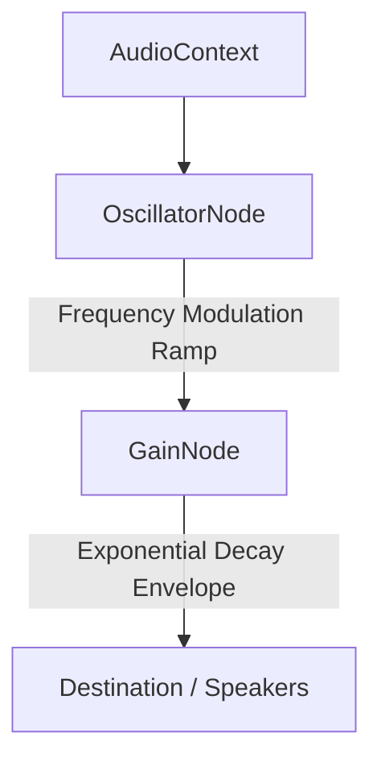
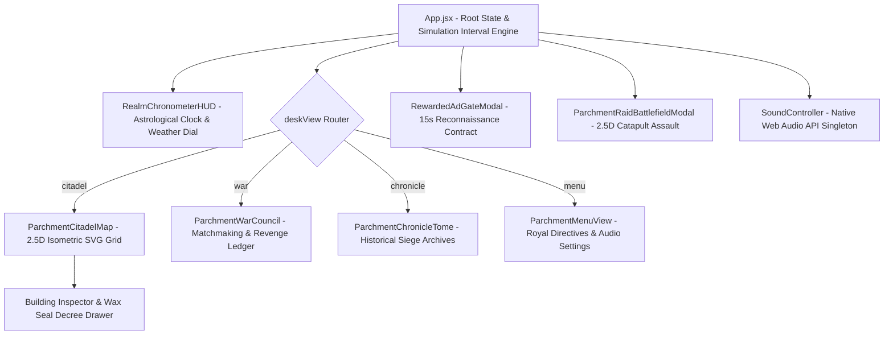

# 📜 Realm Raiders: The Living Parchment

> *"From the sovereign's desk, kingdoms rise under the wax seal and fall beneath the catapult's stone."*

[](https://react.dev/)
[](https://tailwindcss.com/)
[-F59E0B)](#-zero-asset-procedural-web-audio-synthesizer)
[](#-25d-isometric-cartography--projection-math)
[](#-deterministic-state-persistence--offline-engine)
[](LICENSE)

**Realm Raiders** is a single-screen, asymmetric medieval fantasy realm management, continuous astrological simulation, and asynchronous PvP catapult siege engine. Framed entirely from the diegetic vantage of a ruler seated at a grand royal cartographer's desk, the game marries deep macroeconomic simulation with tactile, physical parchment interactions and real-time procedural audio synthesis.

---

## 🧭 Table of Contents
1. [The Diegetic Vision & Aesthetic](#-the-diegetic-vision--aesthetic)
2. [Asymmetric Faction Strategic Matrix](#-asymmetric-faction-strategic-matrix)
3. [Astrological Simulation & Meteorology](#-astrological-simulation--meteorology)
4. [2.5D Isometric Cartography & Projection Math](#-25d-isometric-cartography--projection-math)
5. [Citadel Infrastructure & Economy](#-citadel-infrastructure--economy)
6. [War Council, Catapult Sieges & Revenge Ledger](#-war-council-catapult-sieges--revenge-ledger)
7. [Zero-Asset Procedural Web Audio Synthesizer](#-zero-asset-procedural-web-audio-synthesizer)
8. [Deterministic State Persistence & Offline Engine](#-deterministic-state-persistence--offline-engine)
9. [Architecture & Component Hierarchy](#-architecture--component-hierarchy)
10. [Quickstart & Development](#-quickstart--development)

---

## 🕯️ The Diegetic Vision & Aesthetic

Unlike generic strategy games cluttered with modern flat SaaS cards and detached HUDs, **Realm Raiders** immerses the player entirely within a medieval ruler's chamber:

* **The Sovereign's Desk**: Every decree, map view, war council roster, and siege report is laid out on antique sheepskin parchment (`#ebdcc1`, `#dfcba6`, `#bfa379`), weathered wood, and iron-bound book bindings.
* **Hot Wax Decrees**: Upgrades and royal orders are sanctioned by pressing royal wax seals onto parchment, delivering tactile visual splats, sizzling wax, and deep mechanical thuds.
* **Quill & Calligraphy**: Sepia inks, hand-drawn vector engravings, animated chimney smoke plumes, and rotating windmill sails bring the parchment cartography to life.
* **Mobile-First Responsive Scale**: Engineered from the ground up for fluid play across all form factors, maintaining flawless diegetic balance from 375px mobile screens up to 4K ultra-wide monitors.

```
+-------------------------------------------------------------------------+
| [Hour 14:20 - Day 12]  Verdant Thaw 🌸  Monsoon Deluge 🌧️  Speed: [2x]   |
+-------------------------------------------------------------------------+
|                                                                         |
|            [2.5D ISOMETRIC PARCHMENT CITADEL CARTOGRAPHY]               |
|                                                                         |
|                         / \                                             |
|                       /     \          [Ballista Bastion]               |
|                     /   🏰    \                 |                       |
|                   / [Royal Keep]\               v                       |
|                 / \             / \          🏹 [g: 2,0]                |
|               / 🌾  \         /  🪙 \                                   |
|             / [Granary]\     / [Vault]\                                 |
|             \           /   \         /                                 |
|               \       /  💧   \     /                                   |
|                 \   / [Aquifer] \ /                                     |
|                   \             /                                       |
|                     \         /                                         |
|                       \     /                                           |
|                         \ /                                             |
|                                                                         |
+-------------------------------------------------------------------------+
| [Food: 840/1200]  [Water: 920/1200]  [Wood: 610/1500]  [Gold: 1420/2000]|
| Decrees: [Upgrade Keep (Stamp Seal)] | [War Council] | [Chronicles Tome]|
+-------------------------------------------------------------------------+
```

---

## ⚔️ Asymmetric Faction Strategic Matrix

Four ancient factions contest the fractured realms. Each features mathematically distinct economic production, unique upkeep requirements, and asymmetric siege advantages:

| Faction | Sigil & Title | Economic Specialty | Military Asymmetry & Siege Perk | Upkeep Multiplier | Vault Base Protection |
| :--- | :---: | :--- | :--- | :---: | :---: |
| **Kingdom of Valor** | 👑 *The Master Traders* | Balanced commerce (`1.0x` baseline) | **-50% Royal Decree Costs**<br>+10% bonus spoils on all successful raids | `1.0x` | `25%` |
| **Bloodfury Horde** | 🪓 *The Plunderers* | High Timber & Quarrying (`1.3x Wood`, `1.2x Stone`) | **+40% Raid Attack Bonus**<br>Raids inflict direct structural damage to buildings | `1.5x` *(Hungry warbands)* | `20%` |
| **Sylvaeth Enclave** | 🌿 *The Siphons* | Abundant Waters & Alchemy (`2.0x Water`, `2.0x Flora`) | **Siphon Strikes**<br>Catapult strikes bypass outer walls directly into vaults (`-25% Base HP`) | `0.9x` | `25%` |
| **Ironpeak Holds** | ⛏️ *The Vault Keepers* | Subterranean Mining (`2.0x Gold`, `2.0x Stone`) | **Deep Granite Vaults**<br>Permanently shields **40%** of all stored bullion & reserves (`-35% Farming`) | `1.0x` | `40%` |

---

## 🌌 Astrological Simulation & Meteorology

Realm Raiders features an active real-time astrological clock and meteorological simulation driving realm health:

### 1. The Astronomical Chronometer
* Simulation ticks advance in-game minutes and hours every second, accelerated by **1x**, **2x**, or **5x** speed dials.
* Daylight shifts dynamically, bathing the parchment desk in daylight radiance, golden dusk, or moonlit indigo parchment tints.

### 2. The Four Rotating Seasons (7-Day Cycles)
Seasons transition every 7 in-game days, dramatically altering yields and consumption:
* 🌸 **Verdant Thaw (Spring)**: `+30%` Flora & Aquifer yields, `+15%` population upkeep demand.
* ☀️ **Sunfire Solstice (Summer)**: `+25%` Grain & Timber, `+40%` Water evaporation and upkeep drain.
* 🍂 **Golden Harvest (Autumn)**: `+35%` Food harvest & Bullion minting, `+15%` Catapult Raid Spoils.
* ❄️ **Frostveil Eclipse (Winter)**: `-30%` Agriculture penalty, `+35%` Granite Masonry & deep fortification.

### 3. Dynamic Weather Fluctuations
Weather conditions shift probabilistically every few in-game hours:
* 🌤️ **Temperate Skies**: Pristine conditions, baseline production and balanced raid attack trajectories.
* 🌧️ **Monsoon Deluge**: `+70%` Aquifer water collection, `-15%` raid attack accuracy due to muddy terrain.
* 🔥 **Scorching Drought**: `-50%` Water yield, `+10%` dry incendiary catapult attack potency.
* 🌨️ **Biting Gale**: Severe cold debuffing food/water by `-40%`, granite reinforcement yields up `+20%`.

### 4. Upkeep, Consumption & Famine Debuff
* Upkeep is calculated per tick:
  $$\text{Upkeep}_{\text{Food}} = (\text{Population} \times 0.35 + \text{Garrison} \times 0.65) \times \text{Mult}_{\text{Faction}} \times \text{Mult}_{\text{Season}}$$
  $$\text{Upkeep}_{\text{Water}} = (\text{Population} \times 0.30 + \text{Garrison} \times 0.55) \times \text{Mult}_{\text{Faction}} \times \text{Mult}_{\text{Season}}$$
* **Famine & Drought Penalty**: If Food or Water hits zero, an ominous procedural alarm sounds. The realm enters starvation, inflicting an immediate **50% penalty to Citadel Defense Power**.

---

## 📐 2.5D Isometric Cartography & Projection Math

The citadel map and raid battlefields are rendered in interactive Scalable Vector Graphics (SVG) powered by custom isometric projection math:

```javascript
const ISO_W = 68; // Isometric diamond horizontal span (px)
const ISO_H = 34; // Isometric diamond vertical span (px)

function gridToParchmentIso(gx, gy, originX = 270, originY = 75) {
  return {
    x: (gx - gy) * (ISO_W / 2) + originX,
    y: (gx + gy) * (ISO_H / 2) + originY
  };
}
```

* **Dynamic Layers**: Each building structure renders custom polygon prisms with lighting depth (left, right, and top faceted faces), custom SVG sigils, level badges, and interactive click targets.
* **Worker & Atmosphere FX**: Animated SVG smoke particles float lazily from the Timber Mill and Keep chimneys, while grain windmills turn in real time.

---

## 🏰 Citadel Infrastructure & Economy

The sovereign manages eight specialized structures across the $5 \times 5$ citadel grid:

```
 Grid Coordinate Layout:
 (0,0) . . . . . . . . . (2,0) [Watchtower] . . . . . (4,0)
   .                   .                   .
   .    (1,1) [Granary]        (3,1) [Aqueduct]    .
   .             .               .                 .
 (0,2) [Lumber] . . . (2,2) [Keep] . . . (4,2) [Quarry]
   .             .               .                 .
   .    (1,3) [Herbalist]      (3,3) [Vault]       .
   .                   .                   .
 (0,4) . . . . . . . . . (2,4) . . . . . . . . . . (4,4)
```

| Building | Grid `(gx, gy)` | Type | Primary Role & Yield Cycle |
| :--- | :---: | :---: | :--- |
| 🏰 **Royal Keep** | `(2, 2)` | Core | Citadel command heart; boosts defense rating and unlocks higher structural tiers |
| 🌾 **Windmill & Granary** | `(1, 1)` | Eco | Harvests grain (`55 Food / 12s`); sets Food storage capacity cap |
| 💧 **Spring Aqueduct** | `(3, 1)` | Eco | Pumps fresh spring aquifer water (`50 Water / 10s`) to ward off dehydration |
| 🪵 **Timber Mill** | `(0, 2)` | Resource | Harvests oak timber (`60 Wood / 15s`) for battlements and siege weapons |
| 🪨 **Granite Quarry** | `(4, 2)` | Resource | Chisels stone blocks (`60 Stone / 18s`) to reinforce walls and supply catapult ammo |
| 🌿 **Mystic Herbalist** | `(1, 3)` | Magic | Gathers rare moonlit flora (`35 Flora / 14s`) for alchemical salves and magical wards |
| 🪙 **Ironclad Vault** | `(3, 3)` | Finance | Mints gold crowns (`65 Gold / 20s`) and secures bullion beneath iron vaults |
| 🏹 **Ballista Watchtower** | `(2, 0)` | Military | Perimeter bastion unleashing heavy ballista bolts against enemy scouting vanguard |

---

## 🎯 War Council, Catapult Sieges & Revenge Ledger

### 1. Dynamic War Council & Rival Scouting
The War Council algorithm (`generateRivals`) scours the parchment borders, locating three asymmetric rival realms matched within $\pm 7\%$ of the sovereign's combat rating. Scouts display estimated loot pools, defense garrisons, and rival faction archetypes.

### 2. The 15-Second Scout Contract (Rewarded Flow)
Launching an expedition requires intelligence. Players can initiate a 15-second reconnaissance contract countdown (equipped with a diegetic developer bypass for instant testing) to secure siege coordinates.

### 3. The 2.5D Catapult Siege Minigame
When battle begins, players enter an interactive 2.5D isometric battlefield armed with **3 heavy stone munitions** (`💣 💣 💣`):
* **Target Structures**: Tap to direct catapult fire at the enemy **Keep**, **Granary**, **Vault**, **Lumber Mill**, or **Watchtower**.
* **Procedural Destruction**: Impact strikes collapse targeted isometric prisms into charred ruins (`💥`), triggering screen shake and heavy bass impacts.
* **Loot Calculation & Vault Protections**:
  $$\text{Plunder} = \min(\text{DamageShare} \times \text{RivalLoot}, \; \text{RivalLoot} \times (1 - \text{VaultProtection}))$$
* **Double Loot Bounty**: Sovereigns can claim double plundered spoils upon victory via the rewarded royal merchant agreement.

### 4. Blood Feuds & The Revenge Ledger
Every enemy raid incurred while away is recorded in the **Revenge Ledger**:
* Logs the exact rival name, rival faction sigil, stolen bullion/resources, and time elapsed.
* Grants one-click **Retaliatory Counter-Strike** authorization to settle blood feuds and reclaim plundered riches.
* All triumphs and defensive repels are permanently inscribed into the **Chronicles Tome**.

---

## 🔊 Zero-Asset Procedural Web Audio Synthesizer

Realm Raiders ships with **zero external audio files** (`0 KB` in `.mp3`/`.wav` assets, zero CDN latency, zero missing audio 404s). Every sound effect is synthesized dynamically at runtime using the browser's native **Web Audio API** via `SoundController`:



* 🪙 **Coin Chime (`playCoin`)**: Sine wave frequency sweep from $987.77\,\text{Hz} \to 1318.51\,\text{Hz}$ with sharp $150\,\text{ms}$ exponential gain release.
* 🕯️ **Hot Wax Seal Thud (`playWaxSealThud`)**: Two-layer compound synthesizer:
  * *Sub-bass Thud*: Triangle wave descending $120\,\text{Hz} \to 25\,\text{Hz}$ over $250\,\text{ms}$.
  * *Hot Wax Sizzle*: High-frequency sawtooth oscillator ramping $800\,\text{Hz} \to 300\,\text{Hz}$ simulating molten wax compression.
* 🗡️ **Dagger Thrust (`playDaggerThrust`)**: Fast piercing sawtooth sweep dropping $600\,\text{Hz} \to 80\,\text{Hz}$ over $200\,\text{ms}$.
* 🪨 **Catapult Launch (`playLaunch`)**: Low-to-mid sine pitch ascent $180\,\text{Hz} \to 540\,\text{Hz}$ imitating tension release on wooden timber arms.
* 💥 **Masonry Impact (`playImpact`)**: Heavy sub-bass triangle envelope collapsing $140\,\text{Hz} \to 30\,\text{Hz}$ with $350\,\text{ms}$ resonance.
* 🎺 **Royal Fanfare & Upgrade (`playUpgrade`)**: Four-stage arpeggiated harmonic chord progression ($[440, 554.37, 659.25, 880]\,\text{Hz}$) with staggered $70\,\text{ms}$ offsets.
* ⚠️ **Famine Warning (`playFamineAlarm`)**: Dissonant dual-tone sawtooth warning alarm ($260\,\text{Hz} \to 390\,\text{Hz}$).

---

## 💾 Deterministic State Persistence & Offline Engine

All progress persists seamlessly in `localStorage` under the key `realmraid_parchment_v1`:

```typescript
interface GameState {
  faction: 'humans' | 'orcs' | 'elves' | 'dwarves' | null;
  resources: { food: number; water: number; wood: number; stone: number; flora: number; gold: number };
  buildings: Record<'keep' | 'granary' | 'well' | 'lumber' | 'quarry' | 'greenhouse' | 'vault' | 'watchtower', number>;
  harvestTimers: Record<string, number>;
  timeState: { day: number; hour: number; minute: number; seasonIndex: number; weather: string; timeSpeed: number };
  population: number;
  garrison: number;
  totalRaidsWon: number;
  totalRaidsDefended: number;
  revengeLedger: Array<RevengeEntry>;
  battleLogs: Array<BattleLog>;
  lastTickTimestamp: number;
}
```

* **Deterministic Offline Catchup**: When returning to the royal throne room, the simulation measures $\Delta t = \text{Date.now()} - \text{lastTickTimestamp}$, calculating earned resource cycles and deducting upkeep consumption to ensure fair, authentic offline progression.
* **Corrupt State Recovery**: Automated fallback to `DEFAULT_STATE` prevents broken sessions or blank-screen errors if corrupted data is encountered.

---

## 🏗️ Architecture & Component Hierarchy



---

## 🚀 Quickstart & Development

### Prerequisites
* **Node.js**: v18.0.0 or higher
* **npm** / **yarn** / **pnpm**

### Installation & Run

```bash
# Clone the repository
git clone https://github.com/hoytnix/Realm-Raiders.git
cd Realm-Raiders

# Install dependencies (if configured with Vite/CRA)
npm install

# Start local development server
npm run dev

# Build production bundle
npm run build
```

### Hotkeys & Desk Controls
* **M**: Toggle Global Sound & Audio Synthesizer Mute
* **Click on Citadel Structure**: Open Royal Decree Inspector
* **Stamp Seal Button**: Upgrade selected building with audio thud & ink splats
* **War Council Tab**: Scout rival realms or initiate revenge counter-strikes
* **Catapult Battlefield**: Click rival structures to release heavy stone boulders

---

<div align="center">
  <sub>Forged under royal decree for the glory of the realm. All rights reserved.</sub>
</div>
